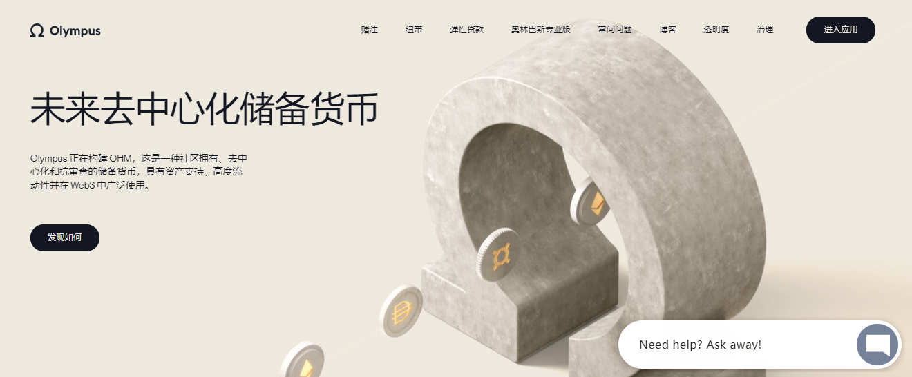

---
title: "Olympus DAO"
description: "奥林巴斯正在建立一个社区拥有的去中心化金融基础设施，为世界带来更多的稳定性和透明度。"
date: 2022-08-19T00:00:00+08:00
lastmod: 2022-08-19T00:00:00+08:00
draft: false
authors: ["june"]
featuredImage: "olympus-dao.png"
tags: ["DeFi","Olympus DAO"]
categories: ["nfts"]
nfts: ["DeFi"]
blockchain: "ETH"
website: "https://www.olympusdao.finance/?utm_source=DappRadar&utm_medium=deeplink&utm_campaign=visit-website"
twitter: "https://twitter.com/OlympusDAO"
discord: ""
telegram: ""
github: "https://github.com/search?q=Olympus+DAO"
youtube: "https://www.youtube.com/results?search_query=Olympus+DAO"
twitch: ""
facebook: ""
instagram: ""
reddit: ""
medium: ""
steam: ""
gitbook: ""
googleplay: ""
appstore: ""
status: "Live"
weight: 
lightgallery: true
toc: true
pinned: false
recommend: false
recommend1: false
---

**什么是 奥林巴斯 DAO ？**

奥林巴斯正在建立一个社区拥有的去中心化金融基础设施，为世界带来更多的稳定性和透明度。
我们正在将协议拥有的流动性带到您附近的 DAO。了解 Olympus Pro，我们的债券即服务协议。
奥林巴斯以复利奖励质押者，这使得质押随着时间的推移变得更加有利可图。

价值存储是一种随着时间的推移稳定或增值的资产。稳定币容易受到通胀政策的影响，而比特币或以太坊则遭受市场崩盘或操纵。这些都不是真正的价值存储。

**OHM 旨在无限增值**

OHM 得到了不断增长的创收金库的支持。我们创造了一种能够在市场条件下不断提高购买力的货币。

