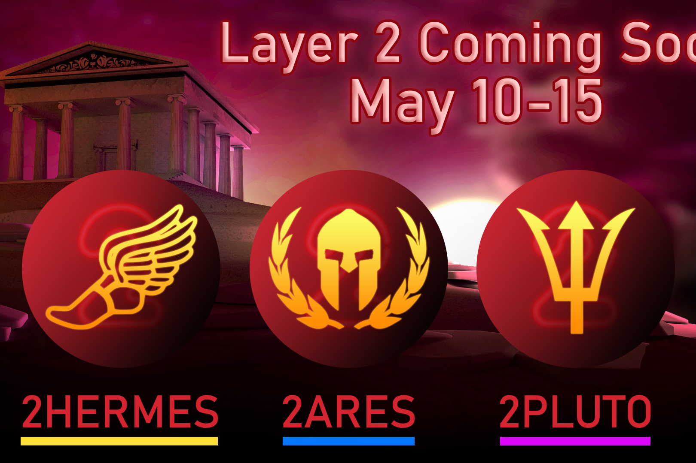

**什么是 Olympus Finance 2  ？**

Olympus Finance 2 的灵感来自之前的算法稳定协议，例如 Tomb Finance。就像 2OMB Finance 一样，我们的协议使用三种代币（THERMES、TARES、TPLUTO）来激励与 $FTM 的稳定 1:1 挂钩。

该协议的底层机制动态调整 $THERMES 的供应，相对于 $FTM 的价格向上或向下推其价格。受到 Tomb 背后最初想法的启发，Olympus Finance 2 是一个多代币协议，由以下三个代币组成：-Peg 代币（$THERMES）。-股票代币 ($TARES) -债券代币 ($TPLUTO)。

