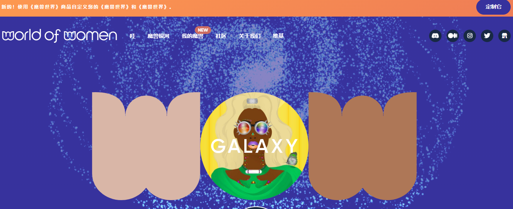

**什么是 Omen？**

因为我们正在努力让世界变得更美好，为了今世后代，我们正在将我们的使命扩展到一个新的层面。但是这些魔兽银河从何而来？它们只是我们第一个系列中的魔兽世界，它们通过门户加入银河系。他们不仅经历了意想不到的变化，而且数量也在增加！

现在有 22,222 个，一如既往的强大和多样化，他们称自己为魔兽银河！让我们团结起来，继续我们的使命，让我们都梦想的公平未来回到地球。

