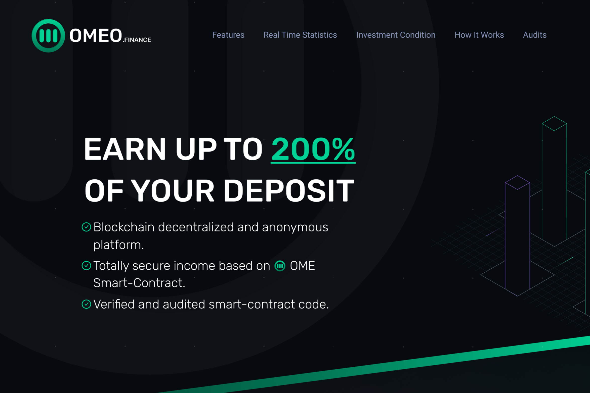

**Omeo.finance是什么？**

OMEO 是一个建立在 TRON 区块链网络上并由智能合约保护的去中心化生态系统。

分散式应用程序现在通过利用智能合约功能和区块链技术的力量实现了无法实现的转变，改变了多个行业。这令人印象深刻，尤其是考虑到DeFi（即去中心化金融）运动的兴起。

也许更有趣的是，我们有分散的应用程序，可以帮助您获得可观的投资回报。例如，在Omeo.finance上，您只需存入或质押您的加密资产，您将获得加密货币投资的被动回报。

OME Cryptocurrency 的创建旨在创建和维持一个美妙的去中心化生态系统，其中分布着多个不同的去中心化项目；质押,钱包,赌博,敏捷。

投资加密货币是彻底改变您的财务生活的最快方法之一。具有去中心化的生态系统、安全的智能合约功能和巨大的盈利潜力。

