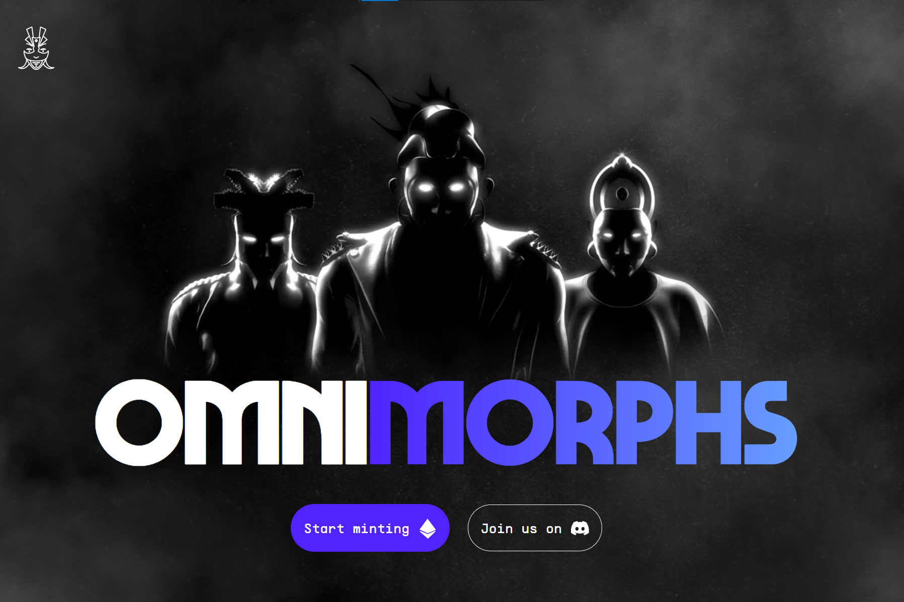

---
title: "Omnimorphs V2"
description: "✨ 10.000 个独特的数字手绘全能模型"
date: 2022-08-19T00:00:00+08:00
lastmod: 2022-08-19T00:00:00+08:00
draft: false
authors: ["june"]
featuredImage: "omnimorphs-v2.png"
tags: ["Collectibles","Omnimorphs V2"]
categories: ["nfts"]
nfts: ["Collectibles"]
blockchain: "ETH"
website: "https://omnimorphs.com/?utm_source=DappRadar&utm_medium=deeplink&utm_campaign=visit-website"
twitter: "https://twitter.com/omnimorphs"
discord: "https://discord.com/invite/omnimorphs"
telegram: ""
github: ""
youtube: ""
twitch: ""
facebook: ""
instagram: "instagram.com/accounts/login/?next=/omnimorphs/"
reddit: ""
medium: "https://omnimorphs.medium.com/"
steam: ""
gitbook: ""
googleplay: ""
appstore: ""
status: "Live"
weight: 
lightgallery: true
toc: true
pinned: false
recommend: false
recommend1: false
---

**什么是 Omnimorphs V2 ？**

Omnimorphs 是一个生成式 NFT 收藏项目，包含 10.000 个独特的数字手绘头像，在以太坊区块链上永生。

Omnimorphs 生活在人类社会的边缘，没有参与，但足够接近观察。尽管它们天生没有任何形状或形式，但在地球上，它们通常选择以人类的身份出现。虽然他们完全平静，但他们的纯粹存在就像是人性的怪诞反映，一种持续的尴尬、好奇的凝视，让人感到不适。

除了令人惊叹的优质艺术品外，我们还致力于为代币创建额外的功能，例如 OmniFusion、未来的空投、可认领的插件收藏等等。

