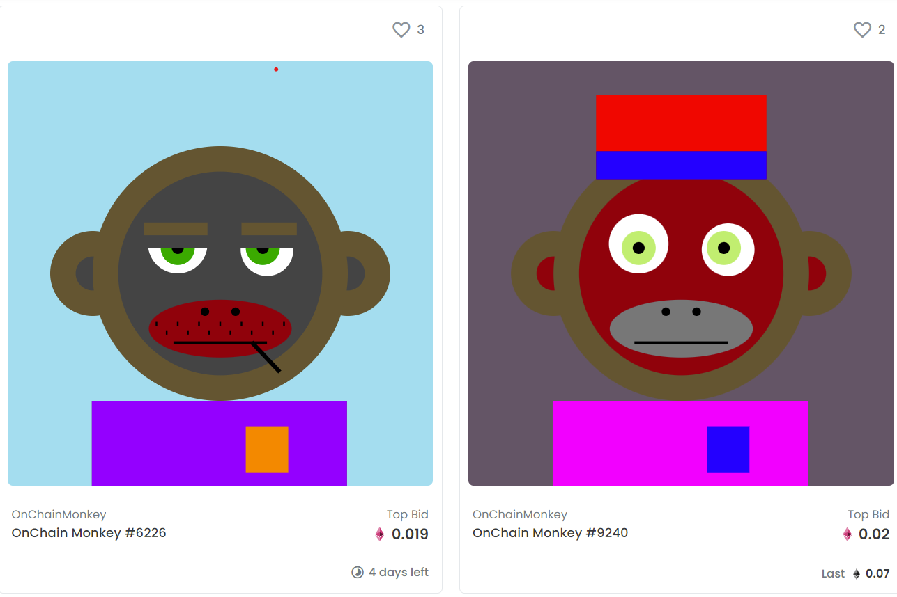

**什么是 OnChainMonkey ？**

完全在具有所有这些属性的链 10k 集合上：

所有元数据都在链上，所有图像都在链上（svg 格式）全部在一个 txn 中创建；

所有 10,000 只 OnChain 猴子都是独一无二的，有 7 个特征，有 171 个值；

特征基于BAYC并上链具有分布和稀有性，这些可以在未来用于其他应用程序和集合，OnChain Monkeys 的个人特征受到 BAYC 的启发。

例如，8 种背景颜色与 BAYC 猿人一样是 8 种。19 款双色调毛皮颜色取自 19 款 BAYC 猿类毛皮，并具有直接 1-1 映射。6 种耳环类型与 BAYC 猿类相似。

