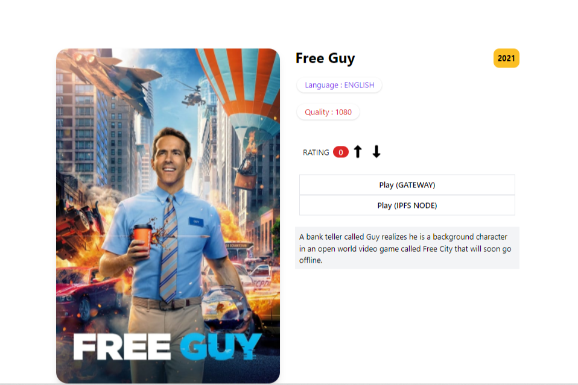

**什么是One Play？**

One Play 是一个基于区块链的视频内容共享平台，使用 IPFS、EVM 和 ENS。由来自全世界的上传者运营，提供匿名去中心化媒体共享。

一个简单，但有效的视频播放器。它带有高级硬件加速和字幕支持。使用One Player在移动设备上享受简单方便的免费播放器。立即免费下载一个很棒的播放器，它将帮助您以前所未有的方式欣赏音乐，电影和电视节目，并具有许多功能

