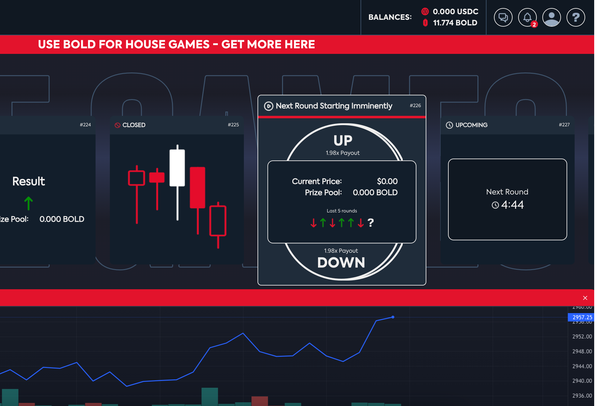

---
title: "OneFortune"
description: "Polygon上开创性的游戏赚取GameFi赌场。"
date: 2022-08-19T00:00:00+08:00
lastmod: 2022-08-19T00:00:00+08:00
draft: false
authors: ["june"]
featuredImage: "onefortune.png"
tags: ["Gambling","OneFortune"]
categories: ["nfts"]
nfts: ["Gambling"]
blockchain: "Polygon"
website: "https://app.onefortune.com/predict-the-market?utm_source=DappRadar&utm_medium=deeplink&utm_campaign=visit-website"
twitter: "https://twitter.com/onefortune_"
discord: "https://discord.com/invite/bcaRExwZFe"
telegram: ""
github: ""
youtube: ""
twitch: ""
facebook: ""
instagram: ""
reddit: ""
medium: ""
steam: ""
gitbook: ""
googleplay: ""
appstore: ""
status: "Live"
weight: 
lightgallery: true
toc: true
pinned: false
recommend: false
recommend1: false
---

**什么是 OneFortune ？**

玩游戏。下注。获得奖励。OneFortune 是一个开创性的游戏赚钱区块链 GameFi 平台。OneFortune 建立在 Polygon 网络之上，让玩家能够获得更低的费用、更快的支付和更大的胜利。

无论您通过我们可证明公平的 P2P 挑战游戏赢或输，您都可以在 BOLD 中获得奖励，或者在 Coin Flip 中拿下房子并使用您的 BOLD 代币预测市场。

更重要的是，当您用 BOLD 输掉一场房子赌注时，代币会被平台烧掉。

随着每个月都会添加新游戏以及每个季度的主要新功能，今天就开始通过 OneFortune 赚取收益。 
与 MATIC 下注。

无论您输赢，都可以赚取 BOLD。

