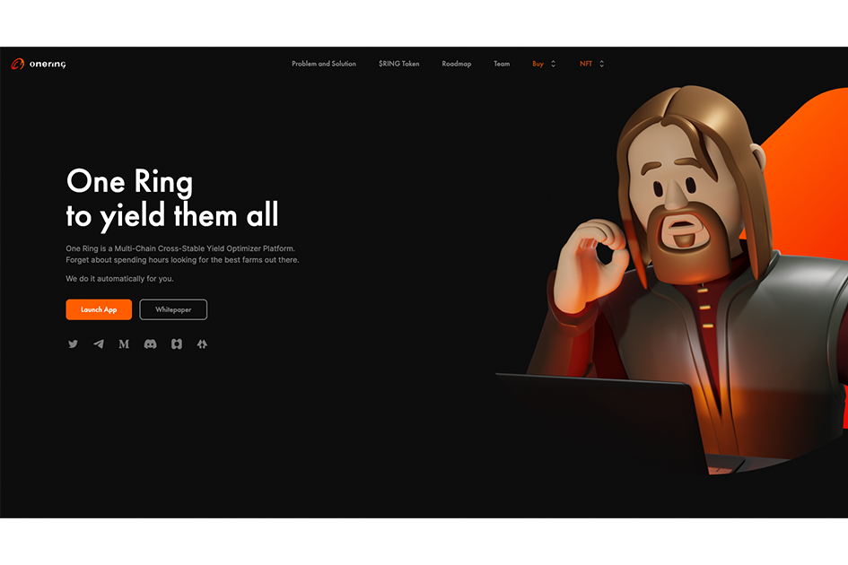

**什么是 OneRing ？**

OneRing 是该领域第一个多链交叉稳定币收益优化器。OneRing 的目标是消除 DeFi 2.0 的复杂性，让用户更轻松。通过这种方式，我们将能够为想要从他们的马厩获得收益的全新用户层打开 DeFi 空间，而不仅仅是让他们坐在钱包里。

凭借强大的合作伙伴、KOL、顾问等网络，OneRing 旨在直奔顶端，为即将到来的 DeFi 2.0 冬季设定新的基准。

