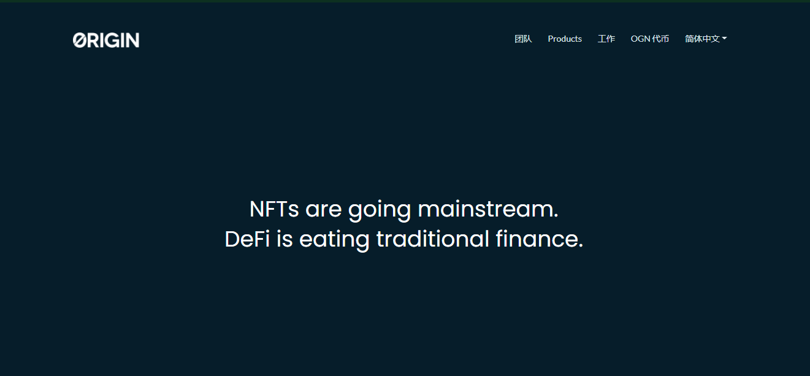

去中心化市场的区块链平台。我们允许买卖双方在没有寻租中间人的情况下进行交易。我们相信降低交易费用，促进自由和透明的商业，并让社区的早期参与者在网络中占有一席之地。

Origin 由成功的硅谷企业家于 2017 年创立，拥有一支来自 YouTube、Google、PayPal 和 DropBox 等标志性科技公司的经验丰富的工程师团队。今天，Origin 是一个拥有数百名开源贡献者和数千名代币持有者的全球社区。我们在公共场合工作，您总能在我们的Discord中发现我们中的至少一个人是清醒的。

