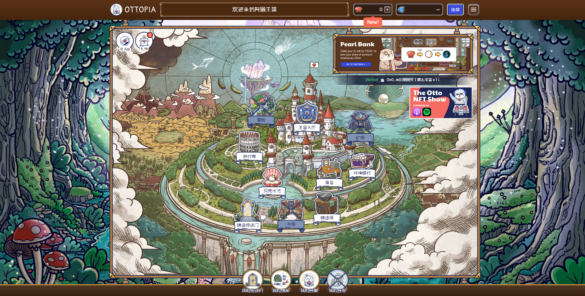

---
title: "OtterClam"
description: "OtterClam 是一个去中心化的生态系统，在元界中融合了金融、治理和 NFT 的元素。这三个组件分别对应于 OtterClam 的金库、DAO 和 Otter Kingdom。"
date: 2022-08-22T20:00:00+08:00
lastmod: 2022-08-22T15:00:00+08:00
draft: false
authors: ["Cindy"]
featuredImage: "otterclam.png"
tags: ["DeFi","OtterClam"]
categories: ["nfts"]
nfts: ["DeFi"]
blockchain: "Polygon"
website: "https://ottopia.app/zh-cn"
twitter: "https://twitter.com/OtterClam"
discord: "https://discord.com/invite/otterclam"
telegram: "https://t.me/otterclam_official"
github: ""
youtube: "https://www.youtube.com/channel/UCDDMx916FeqHmCilGr5WuQw"
twitch: ""
facebook: ""
instagram: ""
reddit: ""
medium: "https://otterclam.medium.com/"
steam: ""
gitbook: ""
googleplay: ""
appstore: ""
status: "Live"
weight: 
lightgallery: true
toc: true
pinned: false
recommend: false
recommend1: false
---

OtterClam 是一个去中心化的生态系统，在元界中融合了金融、治理和 NFT 的元素。这三个组件分别对应于 OtterClam 的金库、DAO 和 Otter Kingdom。OtterClam 是一个由 DAO 管理的社区，由 NFT、DeFi 和元界爱好者组成，他们重视透明度、创新、教育和乐趣。