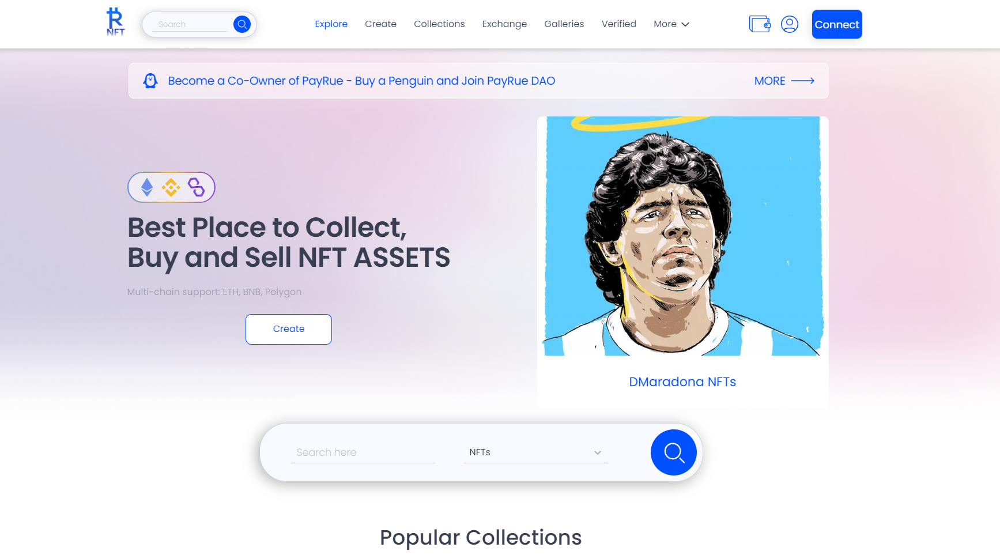

PayRue NFT Marketplace 为 NFT 创作者和艺术家提供了在 Web 应用程序中以及通过 Apple Store 和 Google Play Store 中的 PayRue Wallet 直接创建和上传 NFT 的机会。这些服务支持交换和用户友好的界面。用户可以在 Matic 中为 NFT 定价或使用 Polygon 推动 PayRue 的原生代币。 

治理 产生的 35% 的收入分配给 PayRue DAO，PayRue Penguin 持有者使他们能够在 PayRue NFT 中赚取、投票和构建未来的服务。 