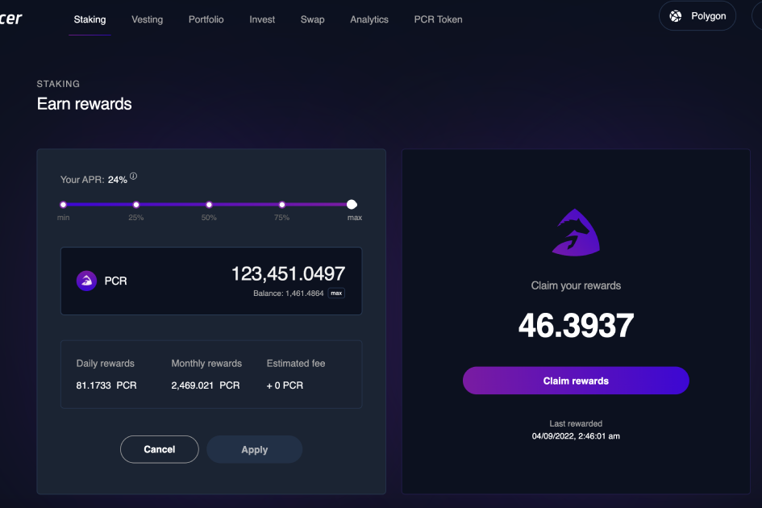

---
title: "Paycer Finance"
description: "Paycer 的目标是聚合多链 DeFi 投资，让用户无需自己的钱包或专业知识即可使用它们。这应该允许任何人在银行不再支付利息的世界中产生被动收入。因此，Paycer 团队正在为 DeFi 和 TradFi 开发一个桥接协议，以结合两全其美，并将其提供给零售客户#CeDeFi。"
date: 2022-08-23T22:00:00+08:00
lastmod: 2022-08-23T14:00:00+08:00
draft: false
authors: ["Cindy"]
featuredImage: "paycer-finance.png"
tags: ["DeFi","Paycer Finance"]
categories: ["nfts"]
nfts: ["DeFi"]
blockchain: ""
website: "https://paycer.finance/"
twitter: "https://twitter.com/paycerprotocol"
discord: ""
telegram: "https://t.me/paycerprotocol"
github: "https://github.com/paycer-protocol"
youtube: ""
twitch: ""
facebook: ""
instagram: "https://www.instagram.com/paycer_protocol/"
reddit: ""
medium: "https://paycerprotocol.medium.com/"
steam: ""
gitbook: ""
googleplay: ""
appstore: ""
status: "Live"
weight: 
lightgallery: true
toc: true
pinned: false
recommend: false
recommend1: false
---
Paycer 的目标是聚合多链 DeFi 投资，让用户无需自己的钱包或专业知识即可使用它们。这应该允许任何人在银行不再支付利息的世界中产生被动收入。因此，Paycer 团队正在为 DeFi 和 TradFi 开发一个桥接协议，以结合两全其美，并将其提供给零售客户#CeDeFi。除了技术问题和超级易于使用的最终产品的创建。目标还在于创建一个监管框架，允许 DeFi 平台首先在欧盟境内合法运营，然后在其他地区合法运营。

目前，Paycer.finance 上已经有一个 DeFi 平台，可以在该平台上申领和质押 Paycer 代币 PCR。更多功能将很快上线。目前在 Polygon 上，但其他区块链将在不久的将来集成。Paycer 还致力于建立银行合作伙伴关系，以便能够将 DeFi 与传统银行账户相结合。除了 DeFi 平台的开发，最终消费产品的开发也在进行中。