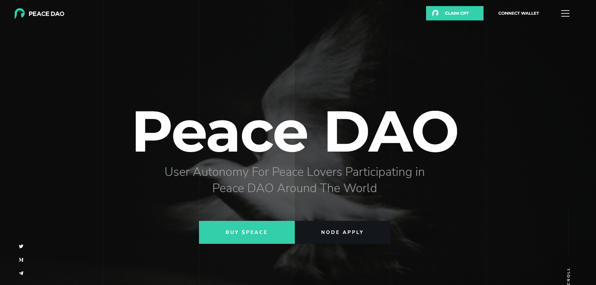

PeaceDAO 是一个没有政治倾向的跨境组织，由 $PEACE 治理代币的持有者推动。为了激发强大的团结网络并坚持促进和平，DAO 每年都会选出“和平奖”的获得者并颁发和平 NFT。 

PeaceDAO

DAO : $PEACE
总金额：21,000,000 (2100 万)
$PEACE 交易费用：
\1. 每次购买将扣除 12% 的费用。
分配
8% PeaceDAO 分享奖励， 2% PeaceDAO 节点奖励， 1% PeaceDAO 运营， 1% PeaceDAO 开发者维护 2. 出售1% DAO 全球和平贡献和2% 注入LP分配
时将扣除3% 费用