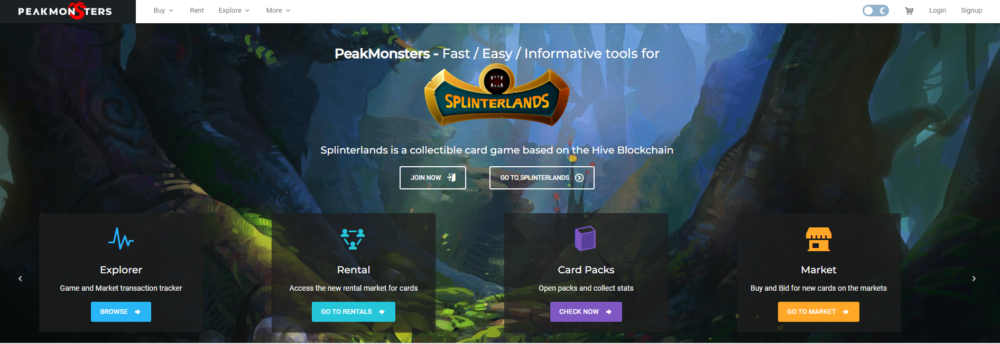

Steem Monsters交易市场

**PKM是**Hive-Engine上的实用代币，将作为奖励分发给 PeakMonsters 用户。该代币将允许 PeakMonsters 社区参与 PeakMonsters 的利润并访问其他工具、功能和特殊活动。 **如何获得PKM将分发（空投）给 PeakMonsters.com 市场的用户。将根据 PeakMonsters 等级进行每周分发。每次大额购买（10 美元以上）也会有奖金分配。**3 月 23 日（那里）将根据（PeakMonsters）用户等级进行一次大型初始空投——这些由过去 52 周的市场量决定。