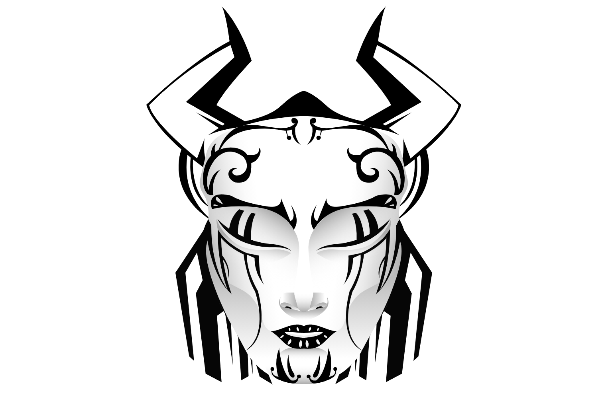

---
title: "Pythagorean Masks"
description: "毕达哥拉斯学派告诉我们，数字是整个宇宙的基础。其余的只是这些的表达。数字就在我们身边，一直是，永远都是。"
date: 2022-08-23T22:00:00+08:00
lastmod: 2022-08-23T14:00:00+08:00
draft: false
authors: ["Cindy"]
featuredImage: "pythagorean-masks.png"
tags: ["Collectibles","Pythagorean Masks"]
categories: ["nfts"]
nfts: ["Collectibles"]
blockchain: "ETH"
website: "https://opensea.io/"
twitter: "https://twitter.com/_n_collective"
discord: ""
telegram: ""
github: ""
youtube: ""
twitch: ""
facebook: ""
instagram: ""
reddit: ""
medium: ""
steam: ""
gitbook: ""
googleplay: ""
appstore: ""
status: "Live"
weight: 
lightgallery: true
toc: true
pinned: false
recommend: false
recommend1: false
---
毕达哥拉斯学派告诉我们，数字是整个宇宙的基础。其余的只是这些的表达。数字就在我们身边，一直是，永远都是。

如果我们的基础现实本身是一个底层算法的表达，那不就是算法现实创建的另一个循环吗？一层一层，无限？因此，由于大爆炸是我们现实创造的象征性表现，@then_project 只是另一个现实的另一个大爆炸——元宇宙。

毕达哥拉斯面具是@_n_Collective 的第一个创作。集体决定将面具作为设计选择，以放大佩戴面具的个人应隐藏自己的身份以使集体能够发光的想法。集体是面具持有者，面具佩戴者；它代表你属于一个社区，即集体，具有以前所未有的方式塑造现实的潜力。