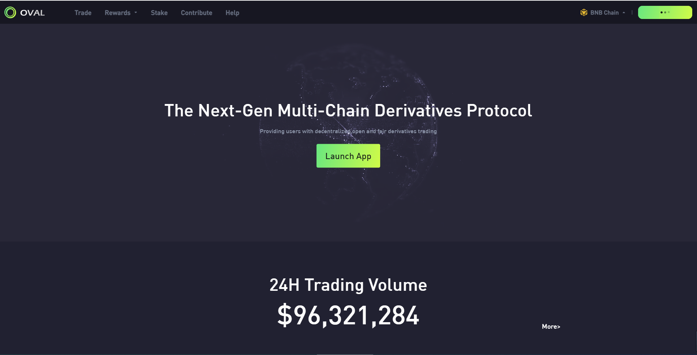

为了给普通用户提供足够低的门槛，无论资金多少都可以轻松参与，节省以太GAS的高昂成本，所以一开始我们选择了BSC网络，团队的技术人员花了很多时间研究Layer2 机制，最终完成了 BSC 网络上订单机制的探索。

我们通过BSC网络上链下链上聚合机制，打造毫秒级订单市场，满足及时聚合市场价最低滑点的需求。作为一个去中心化的衍生品交易所，流动性当之无愧是最重要的。我们已经与大量加密货币行业杰出的 API 做市商进行了对接，以提供与任何交易所一样好的流动性支持。当然，订单簿模型是优越的交易模式，因此我们也会支持订单簿和限价单功能，以满足传统金融用户和普通用户的最佳交易体验。