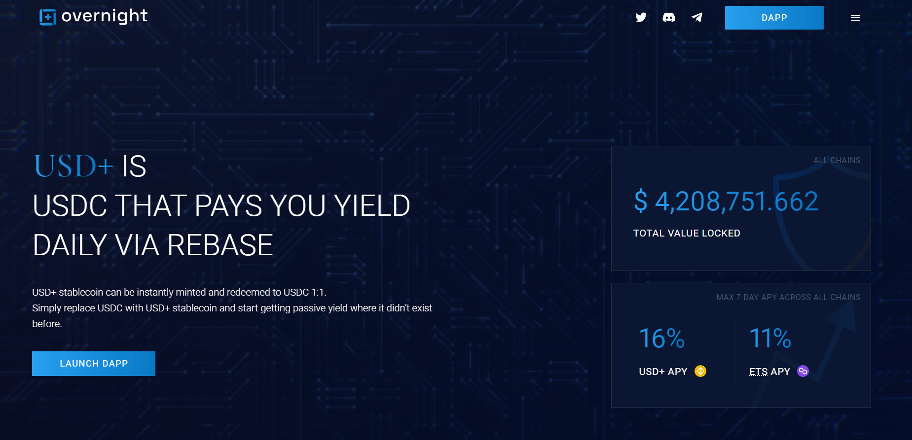

---
title: "Overnight"
description: "OVN 代币与 USDC 挂钩，即在任何时候都可以用 1 USDC 换 1 OVN 和 1 OVN 换 1 USDC。为了维持挂钩，OVN 以 DeFi 资产全额抵押，可按需转换为 USDC"
date: 2022-08-23T22:00:00+08:00
lastmod: 2022-08-23T09:00:00+08:00
draft: false
authors: ["Cindy"]
featuredImage: "overnight.png"
tags: ["DeFi","Overnight"]
categories: ["nfts"]
nfts: ["DeFi"]
blockchain: "Polygon"
website: "https://overnight.fi/"
twitter: "https://twitter.com/ovnstable"
discord: "https://discord.com/invite/7dEceNJqPq"
telegram: "https://t.me/overnight_fi"
github: "https://github.com/ovnstable"
youtube: ""
twitch: ""
facebook: ""
instagram: ""
reddit: ""
medium: ""
steam: ""
gitbook: ""
googleplay: ""
appstore: ""
status: "Live"
weight: 
lightgallery: true
toc: true
pinned: false
recommend: false
recommend1: false
---
OVN 代币与 USDC 挂钩，即在任何时候都可以用 1 USDC 换 1 OVN 和 1 OVN 换 1 USDC。为了维持挂钩，OVN 以 DeFi 资产全额抵押，可按需转换为 USDC

挂钩机制基于'NAV of 1'政策（“资产净值”），即资产的市场价值等于流通中的OVN数量。这是通过

- 保守的风险管理旨在通过建立高度保守的 DeFi 投资的多元化投资组合来避免日常损失
- 每日以空投形式向OVN持有者分配利润

因此，风险管理防止OVN低于面值贬值，而利润分配防止高于面值升值