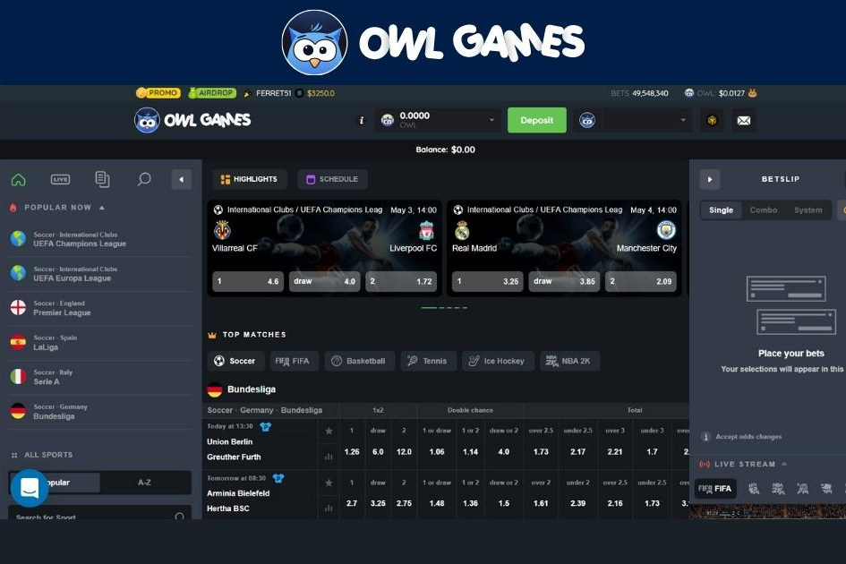

---
title: "Owlgames"
description: "与绝大多数在线赌场不同，OwlGames 释放了 Web 3.0 的力量，让玩家只需连接钱包，即可享受来自世界知名认证游戏提供商的体育博彩和 3000 多种游戏，从而提供增强的赌博体验。支付速度慢、货币选择有限以及需要大量精美印刷品的耗时帐户注册的日子已经一去不复返了。"
date: 2022-08-23T22:00:00+08:00
lastmod: 2022-08-23T09:00:00+08:00
draft: false
authors: ["Cindy"]
featuredImage: "owlgames.png"
tags: ["Gambling","Owlgames"]
categories: ["nfts"]
nfts: ["Gambling"]
blockchain: "BSC"
website: "https://owl.games/"
twitter: "https://twitter.com/TheOwlGame"
discord: ""
telegram: ""
github: ""
youtube: ""
twitch: ""
facebook: ""
instagram: ""
reddit: ""
medium: ""
steam: ""
gitbook: ""
googleplay: ""
appstore: ""
status: "Live"
weight: 
lightgallery: true
toc: true
pinned: false
recommend: false
recommend1: false
---
**猫头鹰游戏**

与绝大多数在线赌场不同，OwlGames 释放了 Web 3.0 的力量，让玩家只需连接钱包，即可享受来自世界知名认证游戏提供商的体育博彩和 3000 多种游戏，从而提供增强的赌博体验。支付速度慢、货币选择有限以及需要大量精美印刷品的耗时帐户注册的日子已经一去不复返了。

**支持的钱包：**

元掩码

幻影钱包

钱包连接

泰拉站

靠近钱包。

**支持的令牌：**

Owl.Games支持的代币列表非常丰富，玩家可以使用各大网络的核心代币，如Bitcoin, USDT, USDC, BNB, AVAX, SOL, LUNA, NEAR, 等大多数社区代币如随着 Shiba、Dogelon Mars、APE 和选项列表的继续，在撰写本文时，共有 49 个受支持的令牌。

**关于猫头鹰游戏：**

OwlGames 是 OwlDAO 的签名平台，OwlDAO 是领先的基于区块链的 Web 3.0 游戏提供商。

OwlGames 由 CyberGalaxy BV 运营，该公司是一家根据库拉索岛法律注册成立的公司。CyberGalaxy BV 由 Antillephone NV 授权和监管

