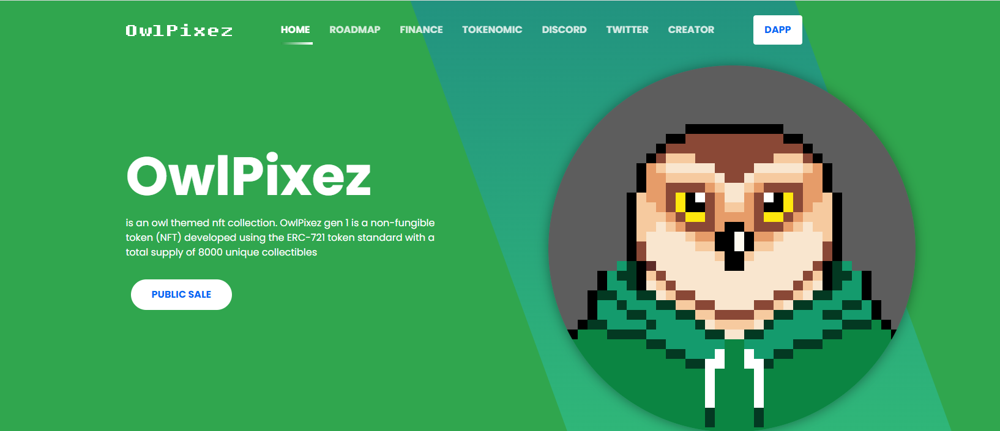

8.000 个独特的OwlPixez Gen 1 的集合，可以访问我们的社区。此系列没有预售，但通过拥有此 NFT，您有机会参与赠品并从版税中获得被动收入，然后您将获得 Owlpixez Gen 2 预售的优先权。

80% 的销售收益将返还给社区，总版税的 20% 将分配给创作者，80% 将分配给活跃持有者和社区领袖。

 OwlPixez Gen 1 是一个 nft 集合，旨在建立一个社区，帮助其成员成长，特别是在 NFT 中。在“nobody”创作者的背景下，希望成员们能够更加相信每个人都有实现梦想的机会。

您可以访问我们的网站以了解更多信息或直接加入不和谐社区。