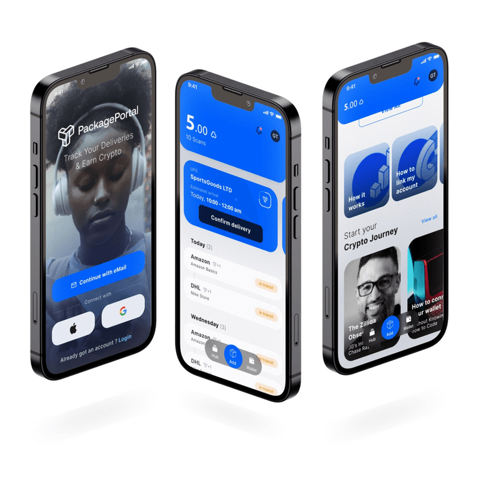

Package Portal Inc 是一家总部位于美国的公司，致力于**通过**其用户参与平台向全世界**推广加密货币。** 我们的无代码服务为商家提供基于区块链的忠诚度和反馈活动的 Web3 集成。我们的团队遍布全球，核心业务位于亚利桑那州凤凰城和马萨诸塞州波士顿。该公司成立于怀俄明州进步的区块链天堂（2019 年），希望为其他美国初创公司在加密领域铺平道路。

我们是一个有凝聚力的团队，其共同使命是构建应用程序，为普通人创造有形且有意义的价值。

我们通过 PackagePortal 实现这一目标，使品牌和消费者能够重新参与并为彼此创造价值。

Gabe 是一名全栈开发人员，拥有超过 10 年的经验，并在初创企业收购期间通过技术和文化变革领导多个工程团队。