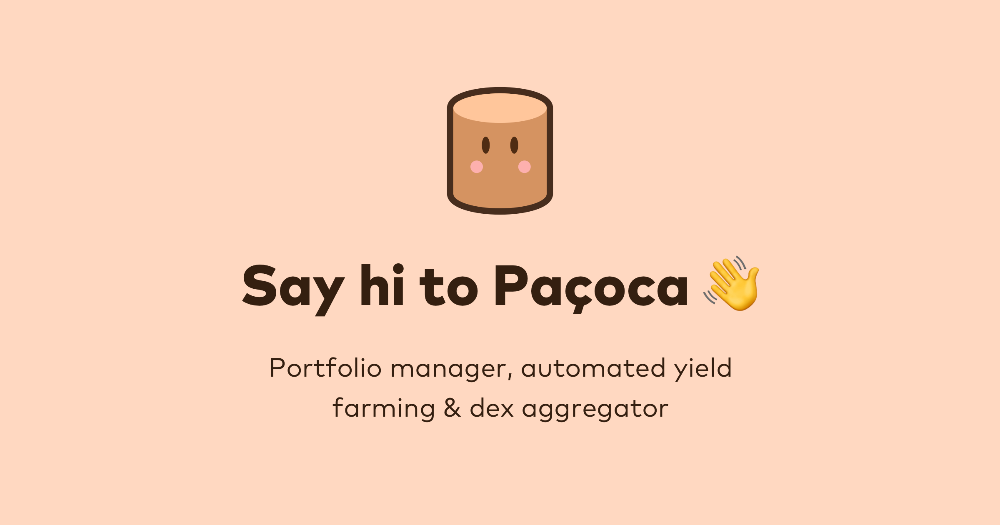

---
title: "Paçoca"
description: "Paçoca 是一个甜蜜的投资组合经理，用户可以在其中跟踪他们的 DeFi 资产，投资具有复合收益率的智能保险库，并使用去中心化交易所聚合器以最优惠的价格交易代币**。**"
date: 2022-08-23T22:00:00+08:00
lastmod: 2022-08-23T14:00:00+08:00
draft: false
authors: ["Cindy"]
featuredImage: "pacoca.png"
tags: ["DeFi","Paçoca"]
categories: ["nfts"]
nfts: ["DeFi"]
blockchain: "BSC"
website: "https://pacoca.io/"
twitter: "https://twitter.com/pacoca_io"
discord: ""
telegram: "https://t.me/pacoca_io"
github: "https://github.com/Pacoca-io"
youtube: ""
twitch: ""
facebook: ""
instagram: ""
reddit: ""
medium: "https://pacoca.medium.com/"
steam: ""
gitbook: ""
googleplay: ""
appstore: ""
status: "Live"
weight: 
lightgallery: true
toc: true
pinned: false
recommend: false
recommend1: false
---
Paçoca 是一个甜蜜的投资组合经理，用户可以在其中跟踪他们的 DeFi 资产，投资具有复合收益率的智能保险库，并使用去中心化交易所聚合器以最优惠的价格交易代币**。**

为优化 Defi 用户的体验而生，其目标是在基于 EVM 的区块链（如 BNB Chain、Fantom 和 Polygon）中提供对不同 DeFi 项目中质押资产的广泛而集中的视图。该平台重视简单性，对于那些正在寻找具有实时投资组合观察者的优雅 DeFi 中心的人来说，它是完美的地方。