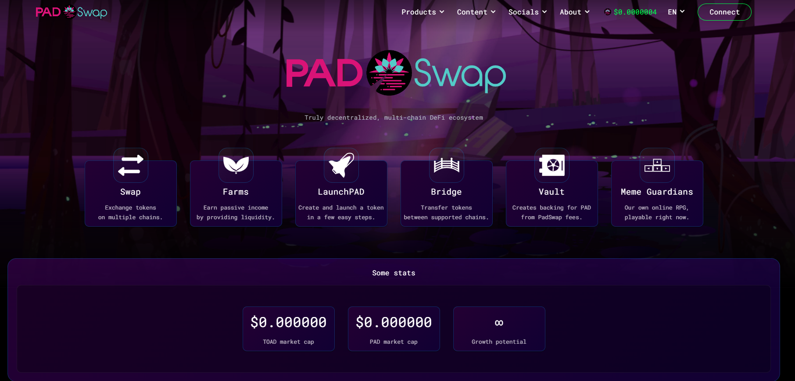

PADSwap 是一个去中心化的交易所（简称 DEX）。PADSwap 也是多链，目前在 BSC、Moonriver 和 Moonbeam 上，未来还会有更多。

Binance、Coinbase、Kraken 或 Crypto.com 等中心化交易所 (CEX) 提供一站式解决方案，将钱包、交易所、法币兑换和其他功能紧密集成到单个多平台应用程序中。因此，新手经常开始在这些平台上交易加密货币。

与这些旧的中心化交易所相比，PADSwap 提供了非托管、无需许可以及在订单簿上使用自动做市商 (AMM) 等优势。

像中心化交易所这样的交易所就像银行。他们持有并处理您的代币。你需要相信他们不会扣留你的代币。

PADSwap 是非托管的，这意味着——与中心化交易所不同——PADSwap 不需要拥有你的代币就可以进行交易。相反，PADSwap 允许用户通过流动性池从他们的钱包（如 MetaMask 或 Trust Wallet）中交易代币。