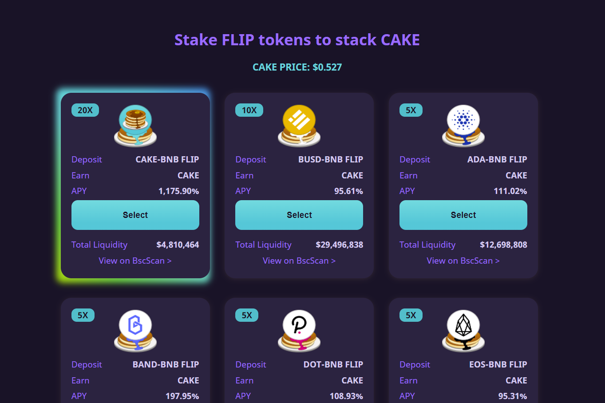

---
title: "PancakeSwap"
description: "PancakeSwap 是一家自动化做市商（“AMM”），允许在币安智能链上交换两种代币。它快速，便宜，并且允许任何人参与。"
date: 2022-08-23T22:00:00+08:00
lastmod: 2022-08-23T14:00:00+08:00
draft: false
authors: ["Cindy"]
featuredImage: "pancakeswap.png"
tags: ["DeFi","PancakeSwap"]
categories: ["nfts"]
nfts: ["DeFi"]
blockchain: "BSC"
website: "https://pancakeswap.finance/"
twitter: "https://twitter.com/pancakeswap"
discord: ""
telegram: "https://t.me/PancakeSwap"
github: "https://github.com/pancakeswap"
youtube: ""
twitch: ""
facebook: ""
instagram: ""
reddit: ""
medium: "https://pancakeswap.medium.com/"
steam: ""
gitbook: ""
googleplay: ""
appstore: ""
status: "Live"
weight: 
lightgallery: true
toc: true
pinned: false
recommend: false
recommend1: false
---
PancakeSwap 是一家自动化做市商（“AMM”），允许在币安智能链上交换两种代币。它快速，便宜，并且允许任何人参与。

**梦想？**

成堆的煎饼、糖浆、生奶油。

早餐后，PancakeSwap 的目标是成为 Binance Smart Chain 上排名第一的流动性提供者，以及新的、创新的游戏化农业机制的发源地，我们怀疑其中许多机制将进入其他链及其他链。