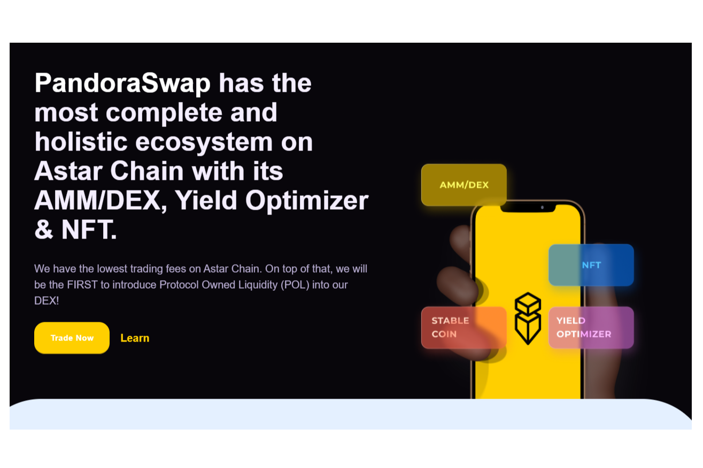

**Pandora swap 是第三代 Defi 协议，是 ASTAR Network 上交易费用最低（0.17%）的最先进的去中心化交易所。最重要的是，我们率先将协议拥有的流动性 (POL) 引入我们在 ASTAR 网络上的 DEX。**

Pandora Swap 旨在成为 DEX 平台的标准。我们希望成为 ASTAR Network 上领先的 DEX 平台。我们非常致力于通过我们精美的商品和服务为去中心化金融提供真实的价值、公平和创新。Pandora Swap 快速且难以穿透。每个人都可以交换并赚取代币。与中心化交易所不同，我们不会在您交易时持有您的资金：您拥有代币 100% 的所有权，您可以直接从您的钱包进行交易，无需任何人持有您的资金！DEX的力量！

