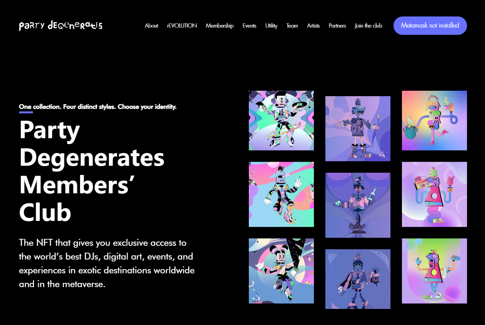

Party Degenerates 是 10,000 个 NFT 的集合，代表了那些选择庆祝生活而不仅仅是生活的人的反叛精神。

他们是职业格格不入的人，心胸宽广，喜欢聚会，并且疯狂到认为自己可以改变世界。他们在雷达下飞行，寻找志同道合的创意者、艺术家、音乐家、建设者和敢于在一个越来越重视规则和一致性的社会中表达自己的真理的信徒。

在更广泛的 NFT 社区中，令人惊叹的杰出数字艺术家和新兴人才的名单已经联合起来，在一个单一的生成艺术项目下释放党的堕落者。

