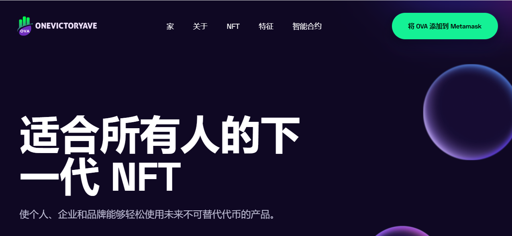

**什么是 OneVictoryAve ？**

什么是胜利大道？我是如何创建这个 NFT 的？

One Victory Ave 为去中心化金融建立了新的市场机制。我们三个可互操作的产品线让您可以在 Smart Chain 上安全地创建、交易和持有数字资产。

One Victory Ave 开发者门户提供介绍、技术文档和教程，One Victory Ave 生态系统基金为团队提供指导、营销和高达 100,000 美元的资金，以在 One Victory Ave 上进行构建。

设置您的钱包，然后您可以在 One Victory Ave 创建、出售和收集 NFT。

上传您的 NFT 并设置价格，为您出售的所有 NFT 赚取 BNB 和 One Victory Ave。

