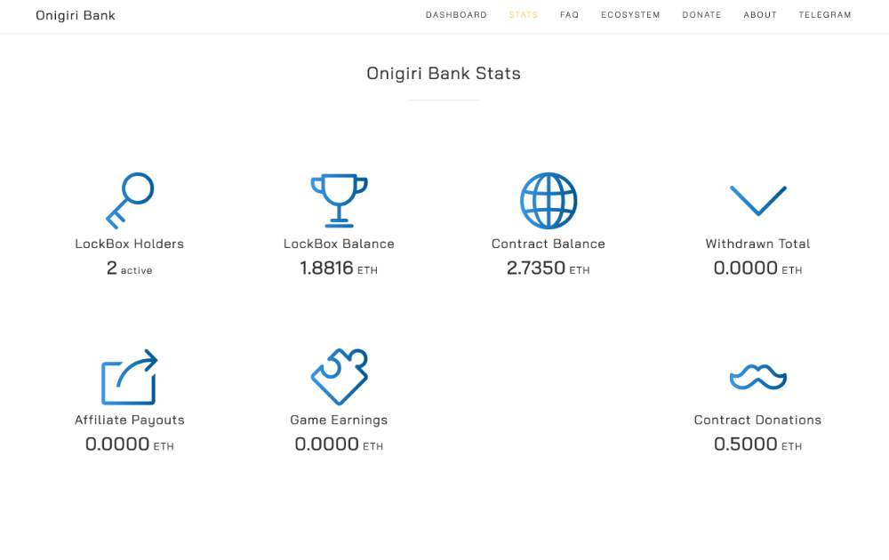

**什么是 Onigiri Bank？**

Onigiri Bank 是以太坊区块链上的原始智能合约。将您的 ETH 保存在 LockBox 中，每天可获得高达 1.8% 的每日奖励。您可以随时提取 100% 的 LockBox，其中包括您的每日复合奖励。

饭团银行充分利用了区块链的力量。这是一款基于ETH区块链上的NFT +元宇宙的游戏，任何人都可以玩。任何新玩家都可以获得游戏代币ETH，以便在虚拟世界中消费或交易。

NFT是一种非同质令牌，NFT提供了一种解决版权问题的新方法：当一个作品被投射为NFT链时，它被赋予了一个无法篡改的唯一代码。无论作品被复制和传播多少次，原作者仍然是作品的唯一所有者。在区块链的帮助下，玩家可以创建稀有的虚拟物品并确保其稀缺性。游戏中的资产是绝对真实的，饭团银行是赚钱的好工具。

饭团银行代币是ETH，这是在区块链上铸造的虚拟代币。

如果玩家体验到饭獗银行的乐趣，他们可以按照官方指示加入。如果你想把赚钱作为副业，你需要仔细思考。

地—深圳市，创新的沃土，软硬件兼备的制造业条件，为虚拟现实及元宇宙的发展提供了得天独厚的成长条件和上不封顶的发展空间。

