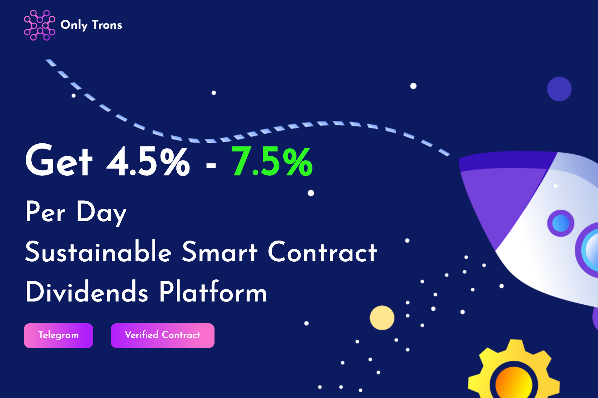

**什么是 OnlyTron ？**

ONLY TRONS是全球首个基于波场区块链和智能合约技术的去中心化社区扶持基金，由人民打造，为人民服务。第一个 Tron DeFi 投资项目。它每天为投资者提供 4.5% 至 7.5% 的股息！

OnlyTrons dApp是建立在Tron协议上的高风险类别的加密资产。现在，根据用户数量，它在一般dApp排名中排名第3366位，在高风险类别中排名第1337位，这使您可以很好地了解OnlyTrons dApp在其竞争对手中的表现。

通过分析过去30天窗口的OnlyTrons dApp数据，很明显，dApp的余额为14.62美元，交易量稳定在0.00美元。OnlyTrons在30天内生成了0笔交易，变化率为0%。显然，与前7天相比，交易量稳定了0%。过去7天的数据显示，OnlyTrons的用户群为0，并且一直稳定在0%。

我们还建议查看OnlyTrons活动概述和智能合约平衡图表，以了解这些重要指标如何随时间波动和变化。