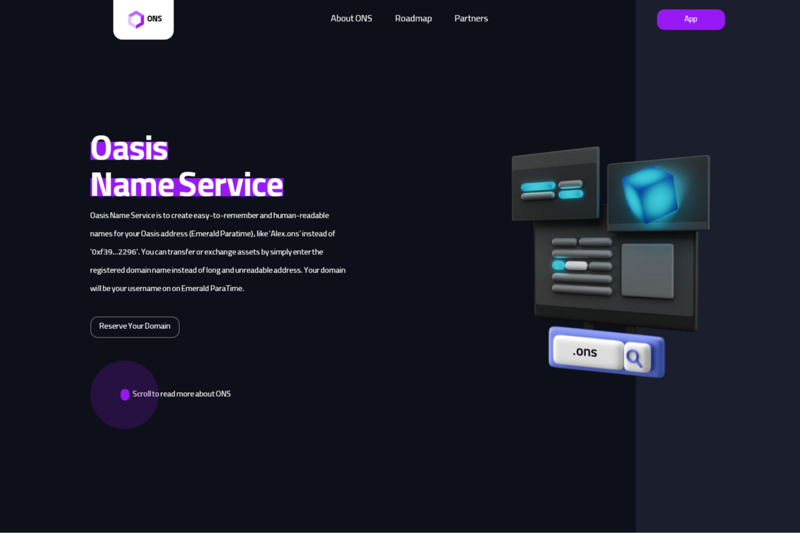

**什么是 ONS：Oasis 名称服务？**

Oasis 名称服务旨在为您的 Oasis 地址 (Emerald ParaTime) 创建易于记忆且易于阅读的名称，例如“Alex.ons”而不是“0xf39...2296”。您只需输入注册的域名即可转移或交换资产，而不是冗长且不可读的地址。您的域名将是您在 Emerald ParaTime 上的用户名。

**什么是 ONS 作为 NFT？**

Domain as NFT 是 Oasis Name Service 的一项功能，可让您将域名注册为 NFT。这使您可以轻松地将您的域名转移到您想要的地方或将其列出出售。您可以拥有任意数量的域。

