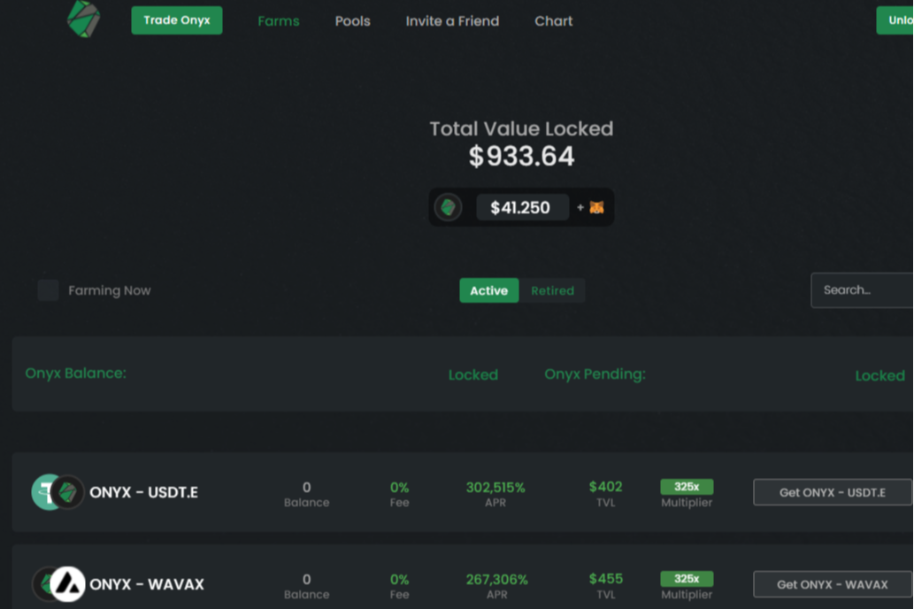

**什么是  Onyx Farm？**

我们是 Avax 网络上的 Onyx Farm，这个项目旨在通过合作和围绕它创建一个强大的社区来发展壮大，我们的目标是成为网络上的大型项目之一，为什么不呢，通过扩展到其他网络！

乘数表示每个农场获得的ONYX奖励金额。例如，如果一个 1x 的服务器场每个块获得 1 个 ONYX，则一个 40x 的服务器场将为每个块获得 40个 ONYX。乘数。获取ONYX - USDC。

