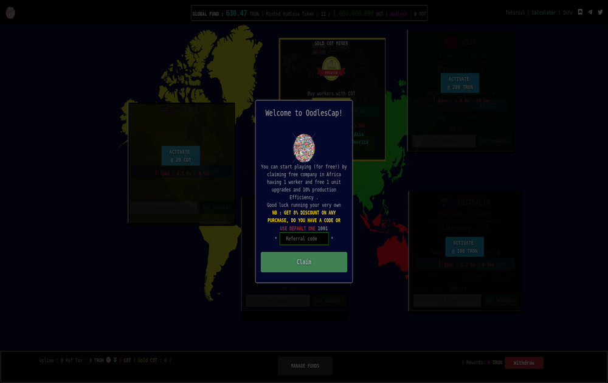

**什么是 OodlesCapitalist ？**

0odlescap 是一款大亨游戏，专注于选择对特定国家的投资、雇佣工人、升级单位以提高效率并产生出售给 tron 的 COT。

**OodlesCapitalist** dApp是建立在**Tron**协议上的**高风险**类别的加密资产。现在，根据用户数量，它在一般的dApp排名中排名**第4430**位，在**高风险**类别中排名**第316位**，这使您可以很好地了解**OodlesCapitalist** dApp在其竞争对手中的表现。

通过分析过去30天窗口期的OodlesCapitalist dApp数据，很明显，dApp的余额为0.00美元，交易量稳定为0.00美元。OodlesCapitalist在30天内生成了0笔交易，变化率为0%。显然，与前7天相比，交易量稳定了0%。过去7天的数据显示，OodlesCapitalist用户群为0，并稳定了0%。

我们还建议查看**OodlesCapitalist活动概述**和智能合约平衡图表，以了解这些重要指标如何随时间**波动**和变化。

