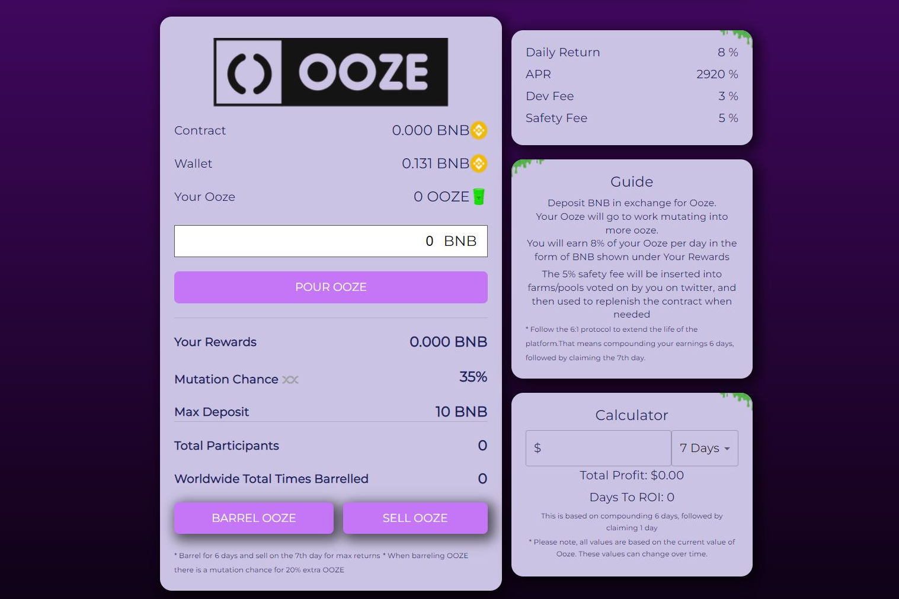

**什么是Ooze？**

Ooze 是一种变异的烤豆叉。 

**它是如何工作的？**

存入 BNB 或 Evmos 并创建 ooze 后，您将开始每天获得 8% 的奖励。你可以重新装上你的软泥并合成你的 BNB 或 Evmo 并创造更多的软泥。您可以选择出售您的 Ooze，这意味着将 BNB 或 Evmos 提取到您的钱包中。但要注意突变，因为这可以使你的软泥增加 20%。最后，有一小笔费用用于投资以增加合约余额！

**这个项目的最佳策略是什么？**

坚持 6/1 的理念（6 天复利，1 提款，这对每个人都是双赢的，并长期支持协议。您可以随时堆叠您的奖励或每天领取，只需注意 8% 的每日回报将开始减少。

