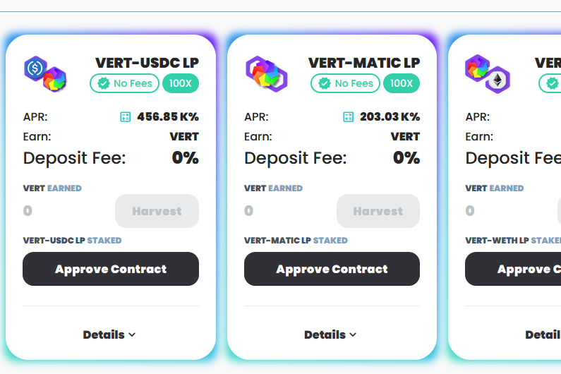

**什么是 polyvertex产量农场？**

Polyvertex的目标是成为多边形/MATAT生态系统中最受社区主导的收益农场。

在通信社区治理硬币（顶点）的推动下，Polyvertex将由支持该项目的人控制。

该项目的目标是长期可持续性，软上限为300万个令牌。第一阶段将是屈服耕作，然后是第二阶段，由社区决定的项目（包括社区想要的话，包括更多的屈服力！）

2％的费用将用于在QuickSwap上购买Vert并燃烧它，从而增加了顶点令牌的价值。

0.05 VERT排放率

