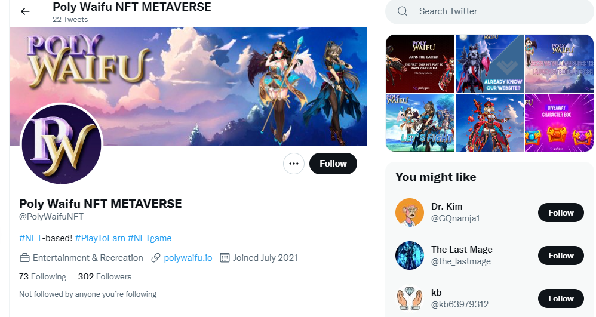

**什么是 polywaifu ？**

Polywaifu是在Polygon Matic网络上发布的基于Web的NFT角色扮演游戏，由玩家驱动，由游戏玩家和游戏玩家制作。

我们的愿景是让游戏玩家重新获得对其数字资产的控制权，通过玩来赚钱，并在日常生活中增加区块链技术的采用。我们的使命是为我们的玩家提供一种有趣而有利可图的体验，以围绕区块链游戏创建一个健康而兴奋的社区，并建立一个游戏生态系统，以赢得系统以满足全球所有游戏玩家的需求。

