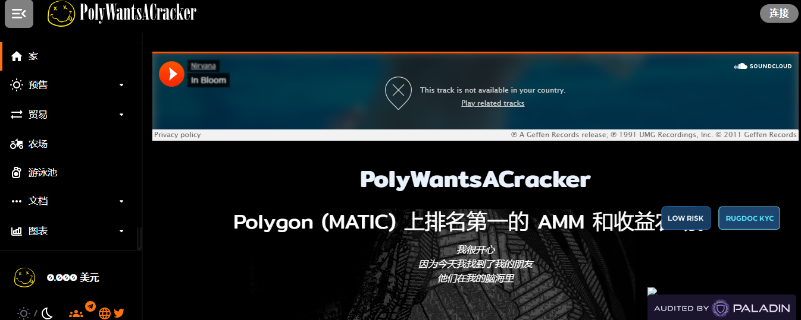

**什么是 PolyWantsACracker ？**

PolyWantsACracker 是 Polygon Network 上的一个收益农场。它是分层农业系统的第一层，第二层将包括通货膨胀农业代币和所有权代币。

Polygon (MATIC) 上排名第一的 AMM 和收益农场。

我很开心，因为今天我找到了我的朋友，他们在我的脑海里。

锂排放已结束。祝贺第一层成功！请不要在 PolyWantsACracker 网站上的任何池中存款。

交换LITHIUM 用于第 2 层预售代币（PRE-ARCADIUM 和 PRE-MYFRIENDS），在耕作结束后 48 小时内使用。所有锂必须在耕种结束后的 2 天内换成第 2 层预售代币。

交换截止日期后，将不再支持 LITHIUM必须在耕作结束后 48 小时内将所有锂换成第 2 层代币。