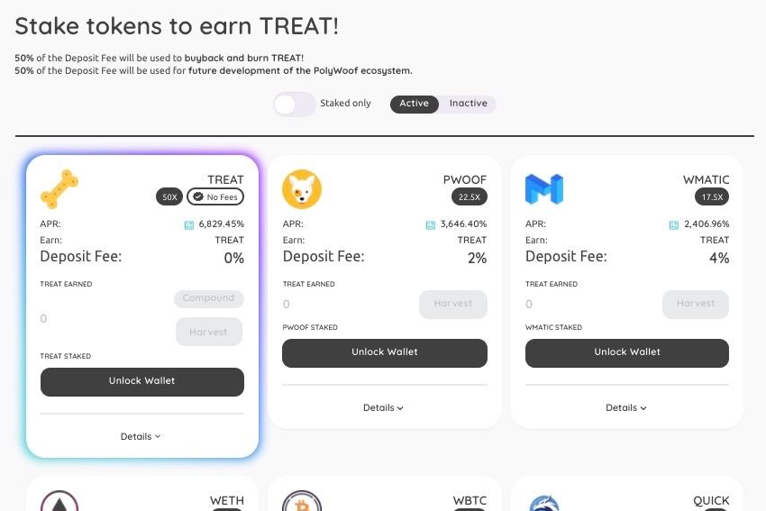

**什么是 PolyWoof ？**

欢迎来到 PolyWoof，Polygon 网络上最可爱的社区驱动的 DeFi 生态系统！

我们最近推出了我们的收益农场，您可以在其中质押代币以在我们的收益农场赚取 TREAT！我们提供具有单一资产池的可持续、高 APR 农业，因此您不必担心无常损失。或者，在我们的农场中质押 LP 代币以获得更高的 APR。

我们在不断地构建新产品，并希望拥有一整套深受 DeFi 社区喜爱的去中心化应用程序。

