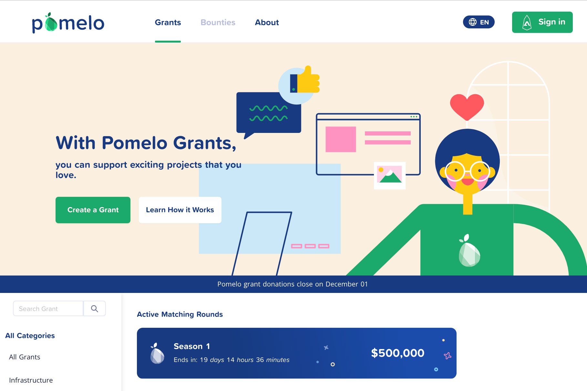

**什么是Pomelo？**

我们的使命是使社区能够建立和资助开放网络。我们通过为建设者和创作者提供在季度拨款中赚取收益的机会来做到这一点。二次资助机制让社区参与决定公共资金的分配。

支持您喜欢的 EOS 项目。Pomelo 是一个可以将您的贡献部署的众筹平台。受 Gitcoin 的网络启发，匹配来自 EOS 基金会的资金提供的资金池。在Pomelo寻找众筹机会中获得最多。订阅EOS Nation Newsletter了解Pomelo动态和EOS生态系统内更广泛的新闻。

