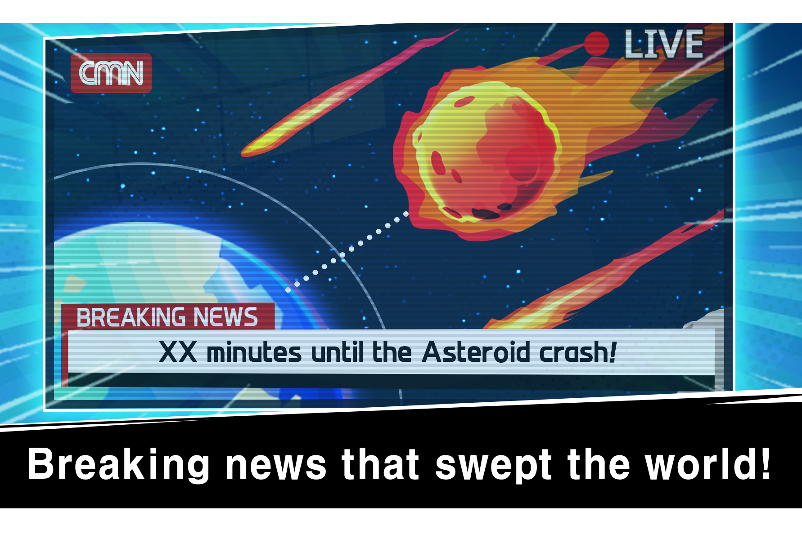

**什么是 博美伦？**

Pomerun 是 Pomerium 团队制作的第一款手机游戏。Pomerun 是一款包含表情包的休闲风格跑步游戏。该游戏将在 App Store 和 Google Play 上推出。

Pomerium 是一个 P2E 平台，发行可用作治理代币的 PMR 代币。

Pomerun是一款休闲风格的跑步游戏，用户可以通过躲避甜瓜麝香和邪恶的大型犬来感受手头的快感。

博美犬试图在陨石碰撞前逃离地球。还有 Melon Musk 和他的追随者阻止了，Pomeranian。成为帮助博美犬寻找逃离地球的宇宙飞船的支持者，并赚取 $PMR。

