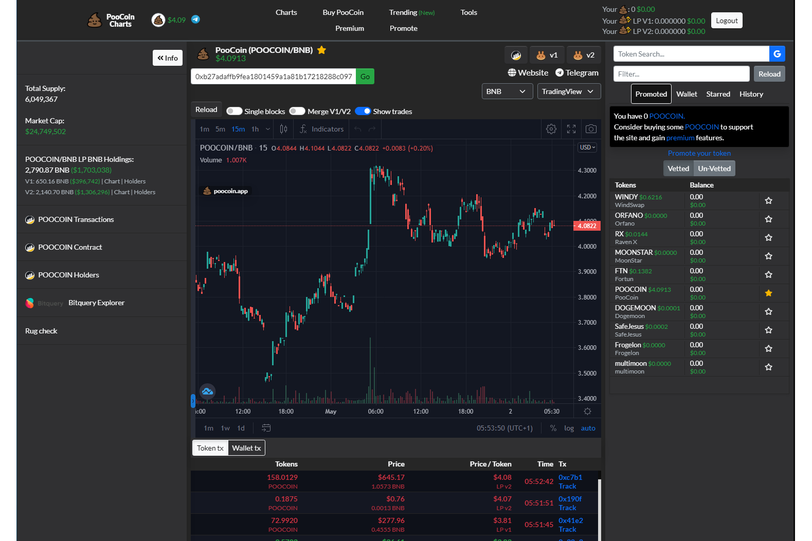

**什么是 PooCoin？**

在币安智能链上查看价格图表并跟踪您的代币组合。查看图表上绘制的您的钱包交易历史。查看趋势 BSC 项目。

PooCoin 也是币安智能链上的一种代币，用于解锁图表 dApp 的高级功能。每笔交易收取 8% 的费用。4% 分配给其他代币持有者，4% 被烧毁。

BSC 图表：查看钱包中任何代币的价格图表（币安智能链）。

在币安智能链上反映代币。每笔交易收取 8% 的费用。4% 分配给其他代币持有者，4% 被烧毁。
初始供应：10,000,000。1笔交易最多可交易100,000。

