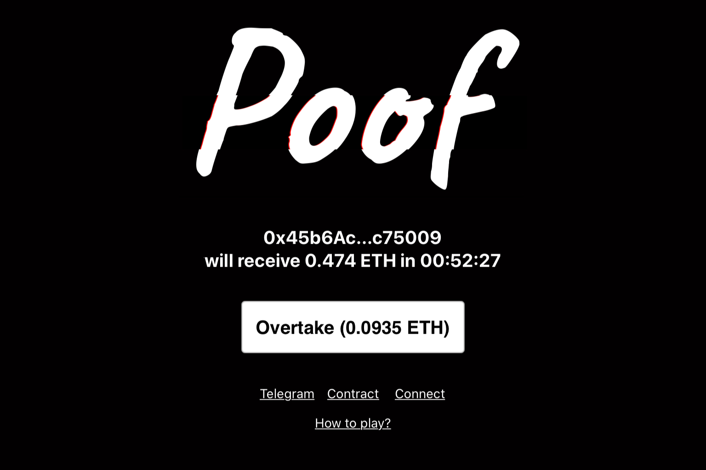

**什么是 Poof？**

0 初始排放，所有代币都按照规则铸造

有一个按钮

如果你按下它，你的地址就会超过即将获胜的人，并且计数器会重置

如果没有人推动它 1 小时，您将赢得大奖

如果有人超过你，你会得到一些 POOF 代币

按下按钮是有成本的，成本每秒下降，但每按一次就会上升

每次有人赢得大奖时，每次超车时产生的 POOF 数量都会减少

资金进入资金池；这些资金用途如下：

头奖的 70%

POOF/ETH Uniswap 流动资金池的 10%

SHUF/ETH Uniswap 流动资金池的 10%

10% 留在池中等待下一个头奖

