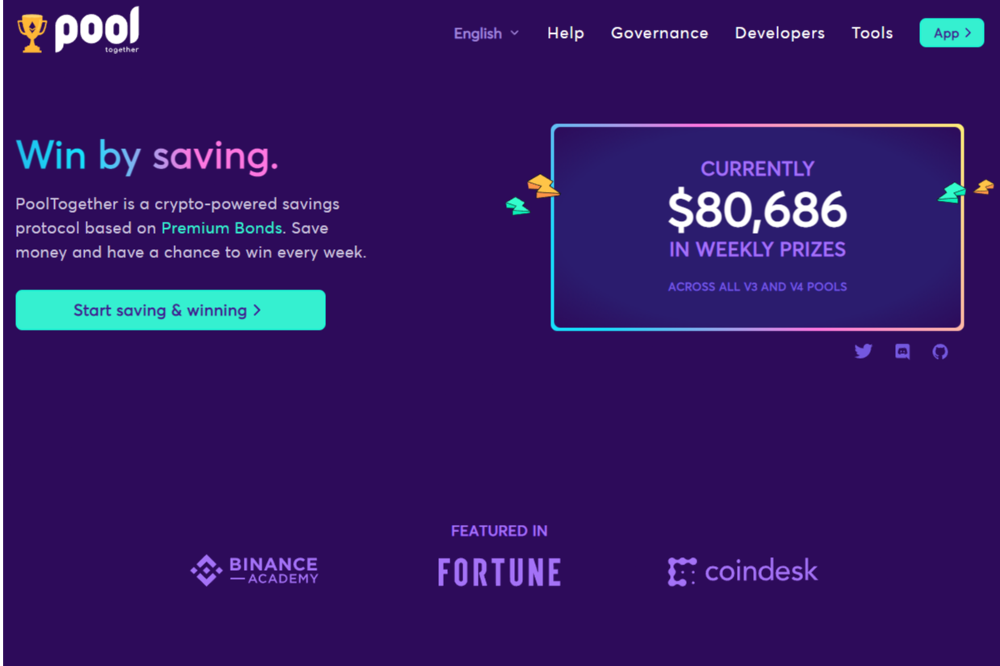

**什么是 PoolTogether ？**

PoolTogether 是一个去中心化的开源区块链协议，用于与奖金挂钩的储蓄。

复制“与奖品挂钩的储蓄账户”，所有储户都有机会赢取奖品，而无需冒着存入资金的风险。这是可能的，因为奖品由所有存入资金的利息组成。

🏦 用户存入网络
📈 所有存款都会产生收益
🏆 收益作为奖品随机奖励给用户。

PoolTogether 协议已经运行了 3 年多，并向储户分发了超过 500 万美元的奖金。迄今为止，最幸运的获胜者存入了 74 美元，并赢得了超过 40,000 美元。PoolTogether 是最早也是使用最广泛的去中心化金融应用程序之一。它通过让人们有机会赢得奖品来帮助他们省钱。

