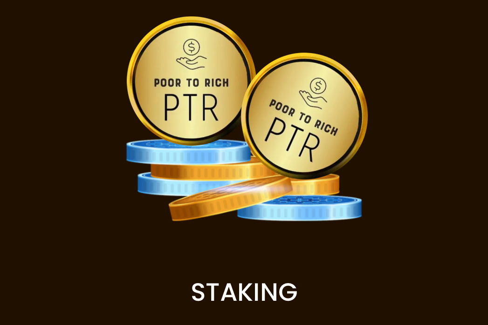

**什么是 PoorToRich金融？**

PoorToRich 是支持加密货币的大规模采用和强化去中心化经济的新一代数字生态系统，它允许用户访问我们的产品和服务并适应现实世界业务的加密货币。

PoorToRich 是第一个具有人工智能的去中心化市场，它允许从新手到专业的用户最大化和增加利润，同时通过 DeFi 和人工智能集成将获得被动收入的风险降至最低。我们正在为加密投资者构建最完整的生态系统。我们相信，金融工具必须简单易用，适合所有人使用。

通过我们的 Defi 和 Al 组合每天和每月赚取被动收入完全自动化的金融工具和多样化您的投资组合。

我们正在设计一个易于使用的平台，周围有 UI/UX 专家，漂亮的界面将投资者最大化其利润所需的所有工具集中在一个地方。

