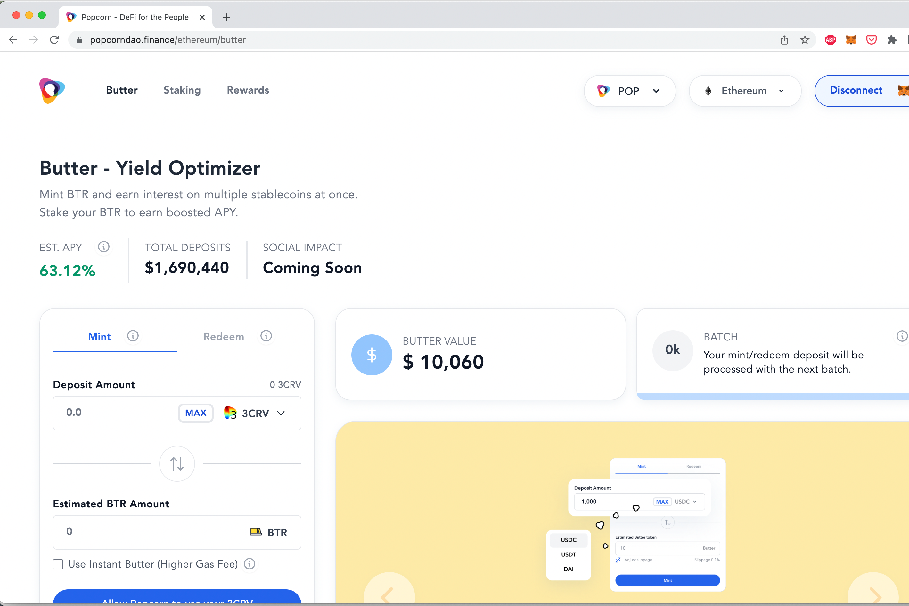

**什么是Popcorn？**

在去中心化金融 (DeFi) 中，社会公益可以融入协议的基础，而不会给最终用户带来任何额外的摩擦或额外的成本。在 Popcorn，我们通过从 DeFi 产品的收益中收取费用来做到这一点；然后，该收益以赠款的形式输送给受益人（由 PopcornDAO 社区成员选择）。

当前的区块链（加密）生态系统对 ESG 不友好。未来属于能够获得有竞争力的回报，同时优先考虑环境、社会和治理问题的组织。

我们相信投资者越来越多地寻找对 ESG 有利的投资，而加密货币的理想定位是在产生积极影响的同时提供高回报。

我们的愿景是成为 ESG 友好型 DeFi 解决方案的领导者，提供易于使用、高收益的投资产品，同时保持碳中和，并将我们的收入用于社会影响和非营利组织。

