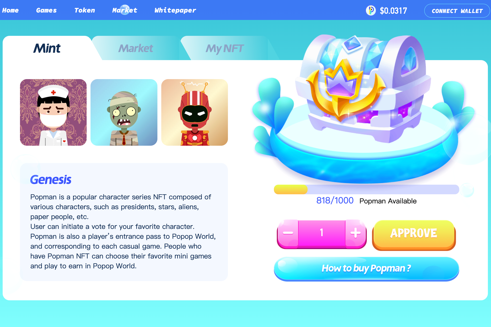

---
title: "Popop World"
description: "世界上第一个区块链上的迷你游戏平台"
date: 2022-08-23T00:00:00+08:00
lastmod: 2022-08-23T00:00:00+08:00
draft: false
authors: ["june"]
featuredImage: "popop-world.png"
tags: ["NFT Games","Popop World"]
categories: ["nfts"]
nfts: ["NFT Games"]
blockchain: "Polygon"
website: "https://www.popop.world/?utm_source=DappRadar&utm_medium=deeplink&utm_campaign=visit-website"
twitter: "https://twitter.com/popop_world"
discord: "https://discord.com/invite/dSm23DyXCv"
telegram: ""
github: ""
youtube: "https://www.youtube.com/channel/UCpPpdCNjm6ty15FDRcQgbtw"
twitch: ""
facebook: "https://www.facebook.com/login/?next=https%3A%2F%2Fwww.facebook.com%2Fpopopworld"
instagram: ""
reddit: ""
medium: "https://popopworld.medium.com/"
steam: ""
gitbook: ""
googleplay: ""
appstore: ""
status: "Live"
weight: 
lightgallery: true
toc: true
pinned: false
recommend: false
recommend1: false
---

**什么是 流行音乐世界？**

Poppop World 的存在是世界上第一个在区块链中引入“玩赚钱”迷你游戏的平台。在一个全球技术都被捕捉到屏幕上的时代，Popop 与 NFT 游戏分享了聚光灯，以提升玩家的体验并增强他们的方式。

“Popman NFT”可供用户通过赢得或使用 Popop 代币购买来获得。Popman NFT 分为五个级别，每个级别都有不同的价值奖励。Popman NFT 增加玩家收入；它还解锁了更多的游戏机会。

Poppop 不制作仅限于某个流派或年龄的 NFT 游戏；凭借独特的界面和多功能的设计，该平台向所有年龄段的人开放。每个游戏都是捏造的，承认玩家的偏好。这要求对任何年龄组的收入限制进行零限制。

我们很高兴地宣布，今天 NFT BabyOrks 已发布！这是“基于 KCC 上从来没有免费的 NFT 铸币厂的想法，或者至少不是主流的铸币厂”——KuPay 说。

先到先得，所以现在就去BabyOrks吧！