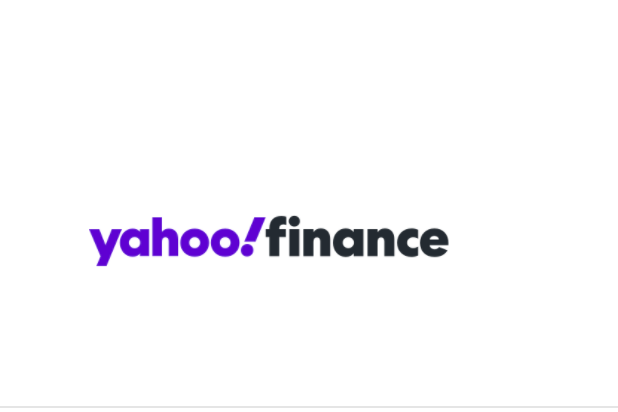

**什么是 PorkSwap？**

PorkSwap 是建立在币安智能链之上的去中心化现货和期货交易平台，其使命是使金融获取民主化，这与去中心化金融 (DeFi) 的理念相关。

目前大多数最大的 DeFi 交易所都专注于现货交易和掉期交易。然而，当前金融系统的很大一部分都在贷款和衍生品上工作。

Porkswap 旨在通过以去中心化的方式引入当前的金融产品，成为 De-Fi 领域的主要颠覆者。我们从现货和期货交易开始我们的旅程。

**BSC 上的去中心化现货和期货交易**

自动做市商驱动，将 De-Fi 游戏提升到一个新的水平。进行即时现货交易，杠杆交易，提供流动性以赚取回报和回报。