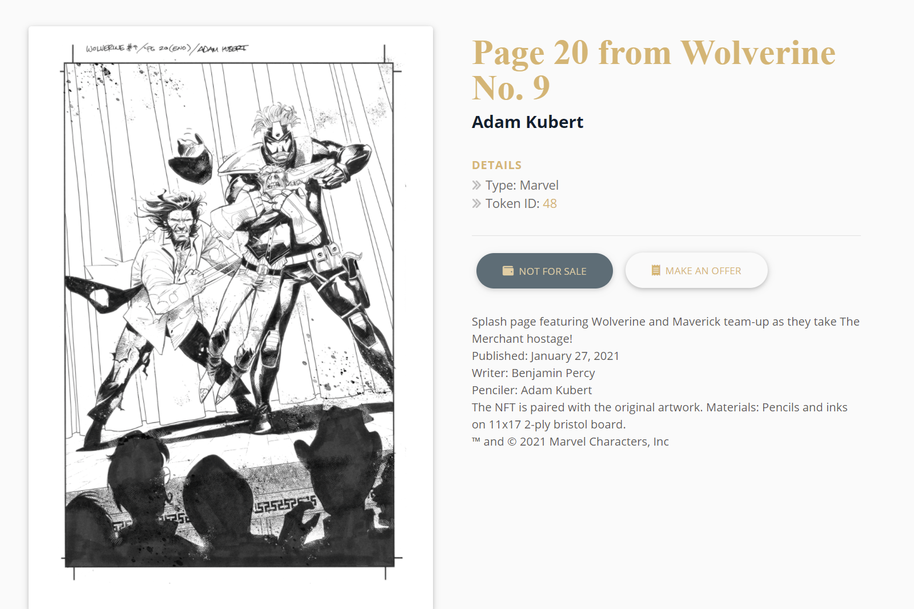

---
title: "Portion"
description: "Part是首屈一指的在线市场，通过区块链技术将艺术家和收藏家联系起来，以轻松销售，投资和拥有艺术品和收藏品。"
date: 2022-08-23T00:00:00+08:00
lastmod: 2022-08-23T00:00:00+08:00
draft: false
authors: ["june"]
featuredImage: "portion.png"
tags: ["Collectibles","Portion"]
categories: ["nfts"]
nfts: ["Collectibles"]
blockchain: "ETH"
website: "https://app.portion.io/#?utm_source=DappRadar&utm_medium=deeplink&utm_campaign=visit-website"
twitter: "https://twitter.com/PortionApp"
discord: ""
telegram: "https://t.me/PortionOfficial"
github: ""
youtube: ""
twitch: ""
facebook: ""
instagram: ""
reddit: ""
medium: "https://medium.com/portion"
steam: ""
gitbook: ""
googleplay: ""
appstore: ""
status: "Live"
weight: 
lightgallery: true
toc: true
pinned: false
recommend: false
recommend1: false
---

**什么是 Portion？**

Portion 是首屈一指的在线市场，通过区块链技术连接艺术家和收藏家，以轻松出售、投资和拥有艺术品和收藏品。

自 2016 年以来，Portion.io 一直在宣传数字艺术和收藏品代币化的概念。我们满怀激情地实现数字稀缺的理念，在 2018 年推出在线虚拟画廊和拍卖行后，我们通过“加密冬天”继续开发该平台。

Portion 团队从未启动过 ICO，在我们的 V1 市场启动之前，资金是从私人投资者那里获得的。

**部分 xNFT NYC 2022**

突破沉浸式体验的界限，我们策划了一系列艺术家，他们正在探索与数字艺术直接相关的物理体验的新思维方式，现在可以购买6月24日在 Lume Studios 举办的活动的门票。