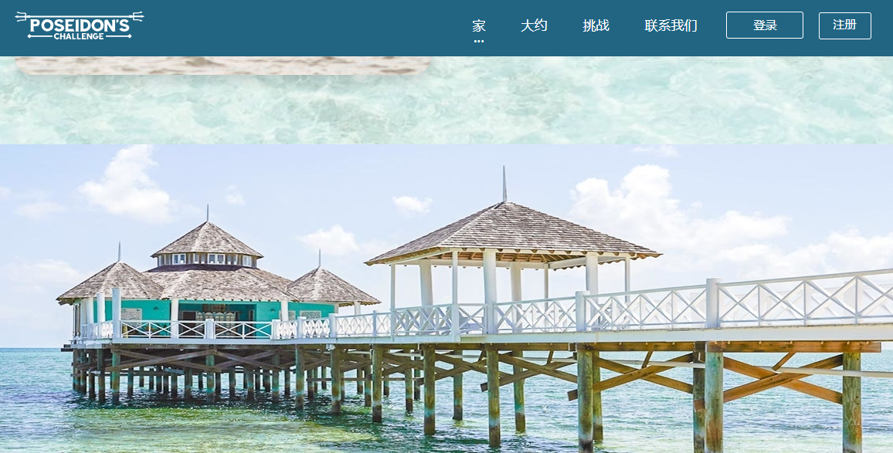

---
title: "Poseidon’s Challenge"
description: "欢迎来到Poseidon’s Challenge"
date: 2022-08-23T00:00:00+08:00
lastmod: 2022-08-23T00:00:00+08:00
draft: false
authors: ["june"]
featuredImage: "poseidon-s-challenge.png"
tags: ["Gambling","Poseidon’s Challenge"]
categories: ["nfts"]
nfts: ["Gambling"]
blockchain: "EOS"
website: "https://poseidonschallenge.com/"
twitter: ""
discord: ""
telegram: ""
github: ""
youtube: ""
twitch: ""
facebook: ""
instagram: ""
reddit: ""
medium: ""
steam: ""
gitbook: ""
googleplay: ""
appstore: ""
status: "Live"
weight: 
lightgallery: true
toc: true
pinned: false
recommend: false
recommend1: false
---

**什么是Poseidon’s Challenge**

Poseidon’s Challenge是潘多拉神庙较低层次的第二个挑战。它始于寺庙外缘的一系列悬崖。之后，克拉托斯向波塞冬神献祭，然后被允许进入更深的寺庙，在那里他发现并获得了波塞冬的三叉戟。

Poseidon’s Challenge是一种独特的冒险体验，将奢华与地球上最具挑战性的水上赛车比赛相结合。

提供只有巴哈马才能提供的独特体验，这种冒险体验将是您愿望清单上的必备品！部分种族活动用于海洋保护，巴哈马飓风救济和退伍军人慈善机构。

