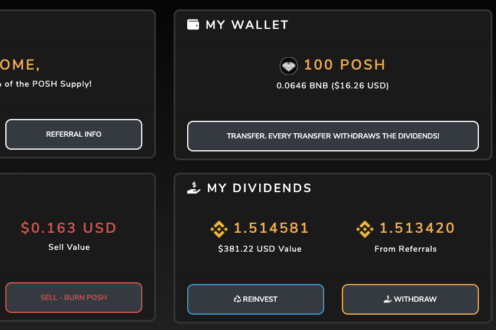

**什么是 PoshVault ？**

Posh Vault 以 bnb 形式向将 Posh 代币存入保险库的持有人支付股息。7% 分配给矿池，3% 分配给推荐人。

OSH VAULT是该项目的一部分，即利息代币。该项目旨在提供持久，活跃的智能合约和多个链上的dapps。

Posh Vault的团队一直在幕后努力工作。他们一直在努力改善用户体验，并为网站未来的扩展做准备。

本周，Posh Vault宣布，他们目前正在通过Seskets Finance进行安全审计。我们对此感到非常兴奋，因为获得安全审计将确保POSH用户的投资是安全的，并且有了这个安全性有助于发展平台。

