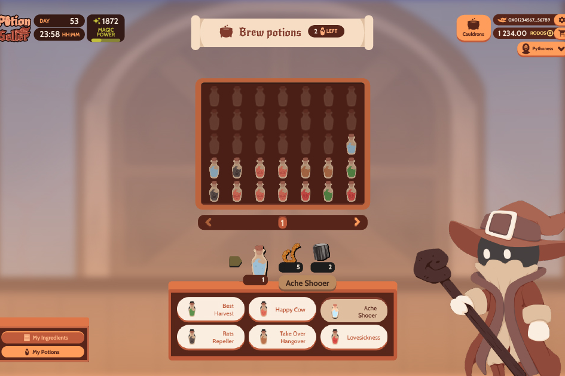

**什么是 Potion Seller？**

Potion Seller是一款基于币安智能链的P2E网页游戏。它具有简单的机制，可提供轻松有趣的体验，这些功能会带来不同的游戏体验，因为您的决定将影响最终产品的质量并可能导致您获得成功。每种药水都是独一无二的，您将获得相应的补偿。此外，在您的库存中持有药水将获得奖励。¡ 与药水卖家一起制作、收集和销售药水！

药水卖家亮点：

1. 在币安网络上实现可玩的 P2E 测试版。
2. 资源管理游戏，真正的“玩赢游戏”，每次点击都很重要并响应策略。

3. 没有原生代币。
4. 精心设计的经济。
5. 大链数据。

